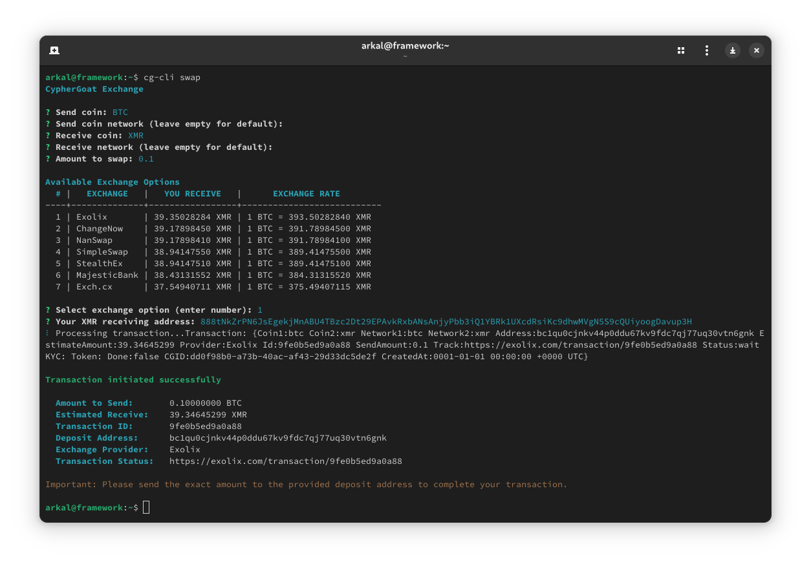

# CypherGoat CLI

### Install cg-cli on your linux machine: `curl https://cyphergoat.com/cli.sh | sudo sh`

After that run `cg-cli swap` to perform a swap using the [cyphergoat](https://cyphergoat.com) api